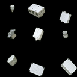
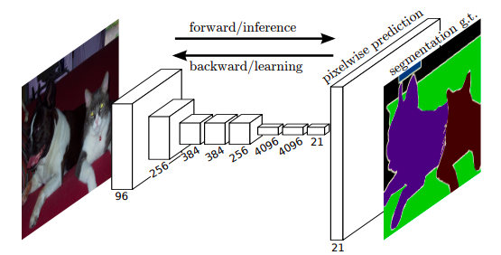

# Sematic Segmentation

This is for semantic segmentation practice.

I will apply semantic segmentation to images provided by [website](http://cmp.felk.cvut.cz/t-less/index.html)[1].

### Table of contents

- [Brief summary of this project(under-construction)](#summary)

- [Detail of the project(under-construction)](#report)

  1. [Introduction](#introduction)

  2. [Dataset and preprocess](#dataset)

  3. [Models](#models)

  4. [Result](#result)

  5. [Conclusion](#conclusion)

  - [References](#references)

     ​

---

## Brief summary of this project (under-construction)

### Dataset

As first step, apply classification to original image dataset.

Example images are shown below.

Fig.1 One of the images from original dataset

10%* of images are used, because original images are too similar and it makes models easily learn, therefore  it might be hard to find differentiation between each models. It is also because limited computer resources.

To make more complex the images are rotated and moved, then concatenated.

Following image is an example of concatenated images.

Fig.2 One of the generated images as inputs

The purpose is to get higher accuracy and segmentation score under restricted environment.

### Classification

In order for judging models, a simple *CNN(Convolutional Neural Network)* model is going to be build as benchmark (3 layers).

After this, build models which have additional several convolutional layers and get scores for comparison.

### Semantic Segmentation

As first step to build simple segmentation model, [*U-net*](https://arxiv.org/pdf/1505.04597.pdf) base model is built and then added *fully convolutional layers* to the model, which is called [*FCN(Fully Convolutional Network)*](https://arxiv.org/pdf/1411.4038.pdf).

Furthermore, dilated convolution models are also built (based on [https://arxiv.org/pdf/1608.06993.pdf](https://arxiv.org/pdf/1608.06993.pdf) and [https://arxiv.org/pdf/1706.05587.pdf](https://arxiv.org/pdf/1706.05587.pdf)).

### Result

The result of semantic segmentation is evaluated by [*Intersection over union(IoU)*](https://en.wikipedia.org/wiki/Jaccard_index).

Following image shows a simple intuition.

Fig.3 IoU image(Wikipedia)

Segmentation are applied to inputs which are generated concatenating original images. Following is one of the results.

  

Fig. 4 A result of semantic segmentation by dilated convolution (left: input image, center: ground truth, right: result)

---

## Detail of the project(under-construction)

### 1. Introduction

I used to work as a mechanical engineer to design large-scale electric product and I have interested in applying machine learning method to hardware.

#### Requirement

- `Python 2.7.x`
- `opencv-python 3.3`
- `h5py 2.7`
- `matplotlib 2.0`
- `numpy 1.12`
- `scipy 0.19`
- `tqdm 4.11`
- `keras 2.0.8`
- `scikit-learn 0.19.1`
- `pillow 4.2.1`
- `tensorflow 1.3.0`

### 2. Dataset and preprocess

Dataset is processed by `Keras`, `OpenCV`, `Scipy`.

### 3. Models

#### 3.1 Simple CNN for classification

The model structure is following.

Fig.5 CNN model for benchmark

Additionally, 5 layers CNN model is built for comparison to benchmark model.
This 5-layer model is going to be a base structure of encoder-layers on semantic segmentation models.

#### 3.2. Semantic segmentation

In this project, segmentation models are built based on following networks.

##### U-Net

U-net[3]

##### Fully convolutional network(FCN)

FCN[2]

##### Dilated Convolution

Dilated convolution\[4]\[5]

### 4. Result

### 5. Conclusion

## References

\[1] [T. Hodan, et al., T-LESS: An RGB-D Dataset for 6D Pose Estimation of Texture-less Objects, 2017](https://arxiv.org/pdf/1701.05498v1.pdf)

\[2] [J. Long, et al., Fully Convolutional Networks for Semantic Segmentation, 2014](https://arxiv.org/pdf/1411.4038.pdf)

\[3] [O. Ronneberger, et al., U-Net: Convolutional Networks for Biomedical Image Segmentation, 2015](https://arxiv.org/pdf/1505.04597.pdf)

\[4] [F. Yu, et al., Multi-Scale Context Aggregation By Dilated Convolutions, 2015](https://arxiv.org/pdf/1511.07122.pdf)

\[5] [Liang-Chieh Chen, et al., Rethinking Atrous Convolution for Semantic Image Segmentation, 2017](https://arxiv.org/pdf/1706.05587.pdf)

\[6] [Xavier Glorot, et al., Understanding the difficulty of training deep feedforward neural networks, 2010](http://proceedings.mlr.press/v9/glorot10a/glorot10a.pdf)

\[7] [Diederik P. Kingma, et al., Adam: A Method For Stochastic Optimization, 2014](https://arxiv.org/pdf/1412.6980.pdf)

\[8] [S. Ioffe, et al., Batch Normalization: Accelerating Deep Network Training by Reducing Internal Covariate Shift, 2015](https://arxiv.org/pdf/1502.03167.pdf)

\[9] [F. Chollet, Xception: Deep Learning with Depthwise Separable Convolutions, 2016](https://arxiv.org/pdf/1610.02357.pdf)

\[10] [V. Badrinarayanan, et al., SegNet: A Deep Convolutional Encoder-Decoder Architecture for Image Segmentation, 2015](https://arxiv.org/pdf/1511.00561.pdf)

\[11] [G. Huang, at el., Densely Connected Convolutional Networks, 2016](https://arxiv.org/pdf/1608.06993.pdf)

\[12] [K. He, et al., Spatial Pyramid Pooling in Deep Convolutional Networks for Visual Recognition, 2014](https://arxiv.org/pdf/1406.4729.pdf)

\[13] [G. Ghiasi, et al., Laplacian Pyramid Reconstruction and Refinement for Semantic Segmentation, 2016](https://arxiv.org/pdf/1605.02264.pdf)

\[14] [K. He, et al., Deep Residual Learning for Image Recognition, 2015](https://arxiv.org/pdf/1512.03385.pdf)

\[15] [K. He, et al., Delving Deep into Rectifiers: Surpassing Human-Level Performance on ImageNet Classification, 2015](https://arxiv.org/pdf/1502.01852.pdf)

[16] Y. LeCun, et al., Gradient-based learning applied to document recognition, Proceedings of the
IEEE, 86(11):2278-2324, 1998

- ​[http://cmp.felk.cvut.cz/t-less/index.html](http://cmp.felk.cvut.cz/t-less/index.html)
- [https://meetshah1995.github.io/semantic-segmentation/deep-learning/pytorch/visdom/2017/06/01/semantic-segmentation-over-the-years.html](https://meetshah1995.github.io/semantic-segmentation/deep-learning/pytorch/visdom/2017/06/01/semantic-segmentation-over-the-years.html)
- [https://en.wikipedia.org/wiki/Jaccard_index](https://en.wikipedia.org/wiki/Jaccard_index)
- [http://blog.qure.ai/notes/semantic-segmentation-deep-learning-review](http://blog.qure.ai/notes/semantic-segmentation-deep-learning-review)
- [http://andyljones.tumblr.com/post/110998971763/an-explanation-of-xavier-initialization](http://andyljones.tumblr.com/post/110998971763/an-explanation-of-xavier-initialization)
- [http://cs231n.github.io/neural-networks-3/](http://cs231n.github.io/neural-networks-3/)
